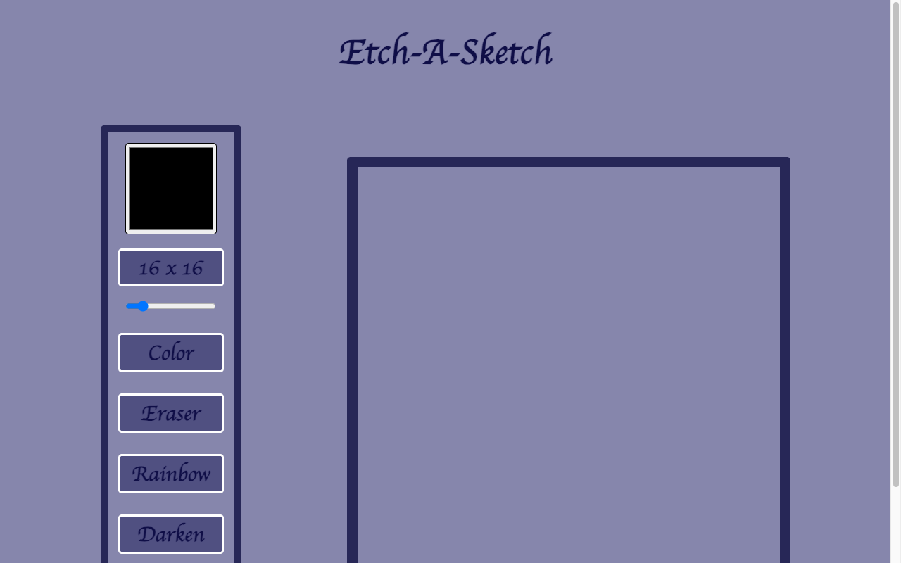

# Etch-A-Sketch

A browser sketchpad built with vanilla JavaScript that generates its grid and toolbar
in script. Built to improve **DOM manipulation** skills.

🔗 **Live demo:** [etch-a-sketch-chi-azure.vercel.app](https://etch-a-sketch-chi-azure.vercel.app/)



## Features

- Adjustable grid resolution generated dynamically.
- Pointer-based drawing across cells.
- Color, rainbow, darken, and eraser modes.
- Clear/reset controls that rebuild the board.

## Tech stack

Vanilla JavaScript · HTML · CSS (no build step)

## Getting started

Open `index.html` directly, or serve the folder:

```bash
npx serve .
```

## What I practiced

Dynamic DOM element creation, **event handling** (pointer events across a grid), and
managing user-controlled canvas state.

## License

Odin Project coursework — original implementation by Aziz Umarov.
